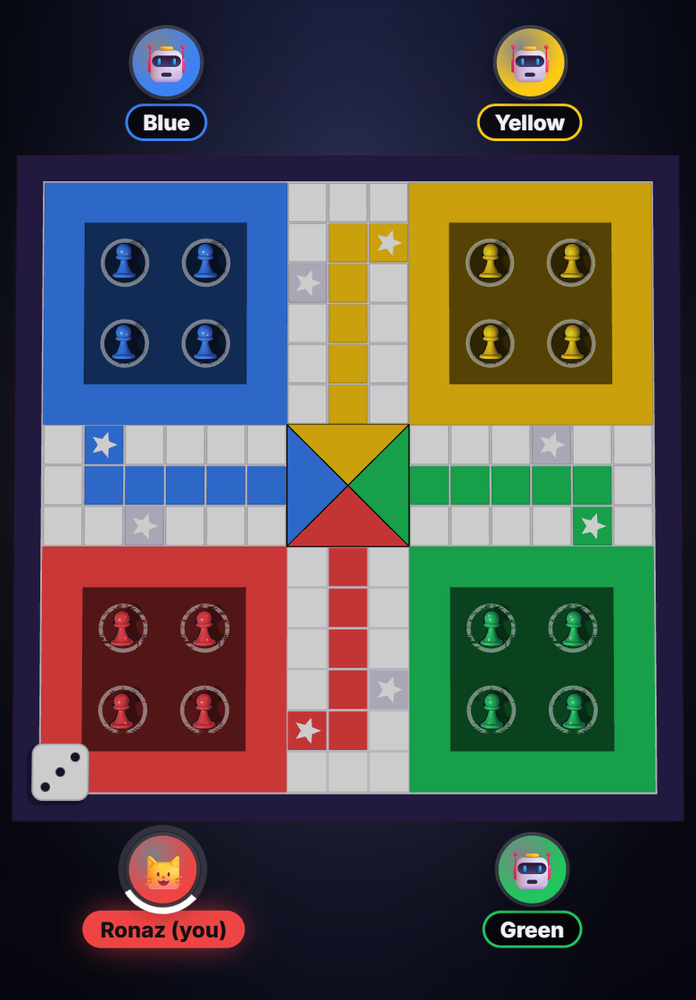

## Problem

Most Ludo apps people around me play are wrapped in ads, coin shops and timers designed to sell you something. I wanted a version where you open a link, share a room code with friends, and play.

## Constraints

- Players are on phones, often on mobile data, and connections drop mid-game.
- Nobody wants to create an account to play a board game with their cousins.
- I'm one person. Whatever I build, I have to run and debug it myself.

## Decisions

**One small server, one dependency.** The server is a single `server.js` using `ws` for WebSockets. Rooms live in memory. There is no database because nothing about a game of Ludo needs to outlive the game.

**Browsers run the game; the server relays.** For Ludo, each browser runs the board, dice and rules, and the server forwards moves between players in a room. This kept the server tiny and let me write the game logic once, in one place.

**Rejoin by replay, not by snapshot.** While you're in a room the browser stores the room code, your player id and every dice/pick decision in `localStorage`. On reload, the game is replayed silently to the current position. A reload, the Back button or a dropped connection puts you straight back in your seat. Sessions expire after 12 hours.

**A turn timer with a bot fallback.** Each turn gets 15 seconds, then 5 more (shown as an orange ring). After that a bot plays for the absent player until they tap "I'm back". One slow player can't stall the table.

## Implementation

- `realtime.js`: WebSocket client with auto-reconnect and heartbeat.
- `game.js`: board, pawns, dice, rules and game loop.
- `online.js`: rooms, lobby, chat, soundboard, rejoin.
- Seating: with two players, the second sits opposite the first; if two players sit side by side, Start moves one to the opposite corner.
- Plain HTML, CSS and JS, no framework. Scripts load in a fixed order.

## Trade-offs

- **Rooms are in memory.** A server restart ends every game in progress. Acceptable for casual play; not for anything with stakes.
- **The host runs CPU players and bots.** If the host goes away, a game with CPUs waits for them.
- **Browsers are trusted for Ludo.** Because clients run the rules, a modified client could cheat. I accepted that for a game between friends, and made the opposite choice for [Jutpatti](/work/jutpatti), where hidden cards make it unacceptable.
- **Not built:** accounts, matchmaking with strangers, leaderboards, purchases.

## Results

Ludo is playable online with friends, with rejoin, turn timers and bot cover working. The repo's test suite (51 tests, run with Node's built-in `node --test`) passed in full on 8 October 2026; most of those tests cover Jutpatti and the shared server.

## What I'd change

Move dice rolls and move validation to the server, the way Jutpatti already works. The relay design was the fastest way to a playable game, but a fair game shouldn't depend on every player's browser being honest.
